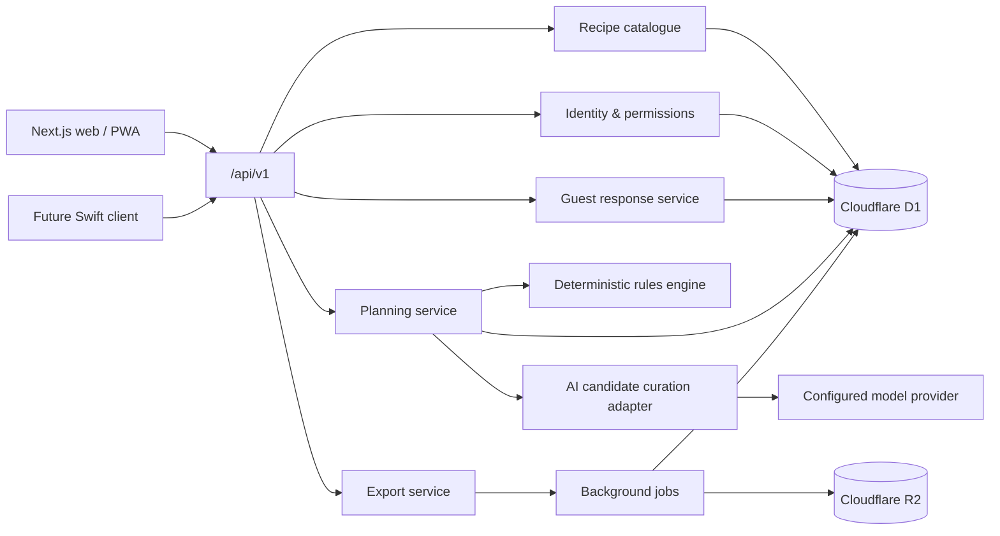

# System Architecture

## 1. Runtime view



The web application and future Swift client use the same versioned API. UI code never talks directly to D1, R2 or an AI provider.

## 2. Domain modules

| Module     | Responsibility                                                                    |
| ---------- | --------------------------------------------------------------------------------- |
| Identity   | Anonymous sessions, magic links, roles and account settings                       |
| Catalogue  | Recipes, ingredients, translations, media, sources and search                     |
| Review     | Publication gates, versions and audit trail                                       |
| Events     | Gathering settings, filter revisions and household profiles                       |
| Guests     | Guest links, responses, expiry and deletion                                       |
| Planning   | Eligibility, role templates, scoring, recomposition and substitution              |
| Nutrition  | Ingredient mapping, snapshots and menu aggregation                                |
| Pricing    | Regional price snapshots, pantry policy and budget calculation                    |
| AI adapter | Server-only validated candidate selection, explanation and substitution narrative |
| Sharing    | Revocable links and QR payloads                                                   |
| Export     | Host/guest/bilingual PDF jobs and R2 objects                                      |

The deterministic planning module must be a pure TypeScript package with no framework, database or model-provider dependency. This allows direct reuse in tests and possible future client-side previews.

## 3. Filter request lifecycle

```mermaid
sequenceDiagram
    participant U as User
    participant UI as Filter workspace
    participant API as Planning API
    participant Rules as Rules engine
    participant AI as AI adapter

    U->>UI: Toggle a facet
    UI->>UI: Update local selection and revision
    UI->>API: Validate filters / eligible count
    API->>Rules: Apply hard constraints
    Rules-->>UI: Count, conflicts, estimated ranges
    UI->>UI: Keep current menu; mark conditions changed
    U->>UI: Recompose or wait for auto-recompose
    UI->>API: Create generation run
    API->>Rules: Rank and compose candidates
    Rules-->>UI: Deterministic menu candidates
    API->>AI: Send only the deterministic candidate allow-list asynchronously
    AI-->>API: Structured candidateId + explanation
    API->>Rules: Revalidate candidate ID, recipe IDs, filters and revision
    Rules-->>UI: Selected safe candidate or deterministic fallback
```

## 4. API outline

All mutable endpoints require an idempotency key where retry could duplicate work.

### Identity and profiles

- `POST /api/v1/auth/magic-link`
- `POST /api/v1/auth/claim-anonymous-draft`
- `GET /api/v1/me`
- `GET|POST /api/v1/profiles`
- `GET|PATCH|DELETE /api/v1/profiles/{profileId}`

### Recipe catalogue

- `GET /api/v1/recipes`
- `GET /api/v1/recipes/{recipeId}`
- `GET /api/v1/reference-data`

### Events and filters

- `POST /api/v1/events`
- `GET|PATCH /api/v1/events/{eventId}`
- `PUT /api/v1/events/{eventId}/filters`
- `POST /api/v1/events/{eventId}/eligibility-preview`

### Generation and substitution

- `POST /api/v1/menu/compose` (stateless launch endpoint; server reloads the catalogue)
- `POST /api/v1/events/{eventId}/generations`
- `GET /api/v1/generations/{generationId}`
- `GET /api/v1/events/{eventId}/menus`
- `POST /api/v1/menus/{menuId}/substitutions`
- `POST /api/v1/menus/{menuId}/select`

### Guests and sharing

- `POST /api/v1/events/{eventId}/guest-links`
- `POST /api/v1/guest-responses/{token}`
- `GET /api/v1/events/{eventId}/guest-summary`
- `POST /api/v1/menus/{menuId}/share-links`
- `DELETE /api/v1/share-links/{linkId}`

### Export

- `POST /api/v1/menus/{menuId}/exports`
- `GET /api/v1/exports/{exportId}`

### Admin and review

- `POST /api/v1/admin/recipes`
- `PATCH /api/v1/admin/recipes/{recipeId}`
- `POST /api/v1/admin/recipes/{recipeId}/reviews`
- `POST /api/v1/admin/recipes/{recipeId}/publish`
- `POST /api/v1/admin/imports`

An OpenAPI document should be generated when implementation begins; endpoint names can still change before that contract is published.

## 5. Background jobs

- Recipe import normalization.
- Nutrition calculation and recalculation.
- Regional price snapshot aggregation.
- Responsive image processing.
- AI illustration metadata processing.
- PDF rendering.
- Guest response deletion.
- Expired share-link cleanup.
- FTS index rebuild and catalogue coverage reports.

Jobs must be idempotent and record visible status. Failed jobs preserve their inputs and a safe diagnostic code.

## 6. Caching and performance

- Cache published reference data and recipe summaries by catalogue version.
- Never cache private guest responses in a public cache.
- Eligibility results may be cached by normalized filter hash and catalogue/ruleset version.
- Use optimistic local facet state; do not wait for AI to acknowledge a selection.
- Reserve image dimensions to avoid layout shift.
- Paginate admin and catalogue lists; the planning engine loads only the fields required for candidate evaluation.

## 7. Security and privacy

- Hash magic/share/guest tokens at rest.
- Authorize every event, menu, export and admin access at the server boundary.
- Minimize guest personal data and set `delete_after` at creation.
- Remove free-text health notes from AI inputs unless required and consented.
- Use synthetic fixtures in tests.
- Keep provider secrets only in managed environment bindings.
- Record recipe and admin changes in the audit log.

## 8. Failure strategy

| Failure                                   | User-facing behaviour                                                                                 |
| ----------------------------------------- | ----------------------------------------------------------------------------------------------------- |
| AI unavailable, timeout or invalid output | Menu remains usable; deterministic first candidate remains selected and explanation shows unavailable |
| Nutrition incomplete                      | Show partial estimate and confidence, never zero-fill                                                 |
| Price snapshot stale                      | Show date and widened estimate range                                                                  |
| No safe recipe result                     | Explain which hard constraints caused the empty set                                                   |
| PDF job fails                             | Preserve menu; allow retry                                                                            |
| Guest link expired                        | Show expiry; only host can create a replacement                                                       |
| D1 overload/transient failure             | Safe retry with idempotency key; no duplicate event/menu                                              |

## 9. Swift migration path

- Keep domain identifiers and API response fields stable.
- Expose locale-neutral quantities plus display hints.
- Do not ship HTML fragments in API responses.
- Use explicit enums and additive API versioning.
- Keep image variants in API metadata.
- Sign in with Apple can attach a second identity to the same user record.
