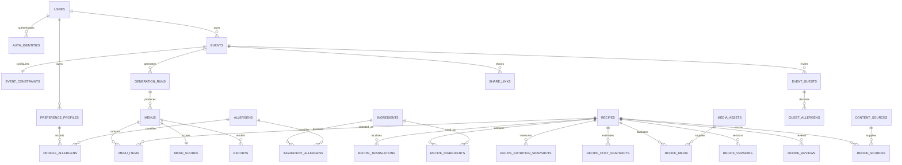
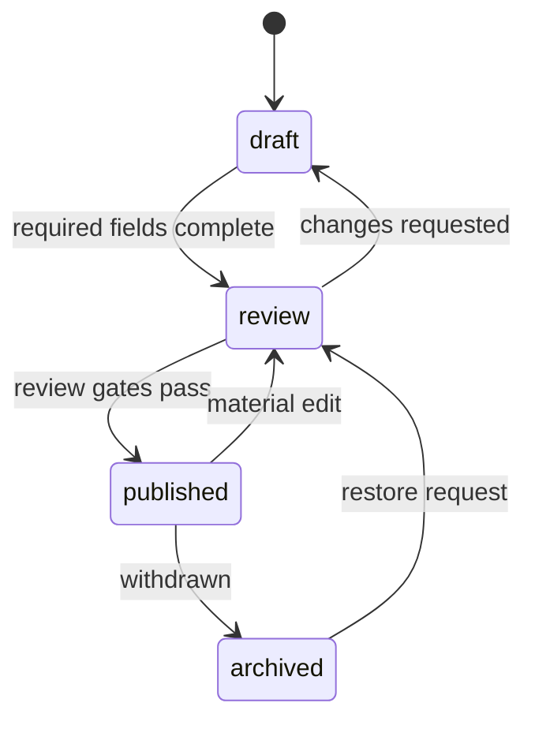

# Data Model

The executable starting schema is in [`db/schema.sql`](../db/schema.sql). It targets Cloudflare D1 and uses application-generated ULIDs plus ISO-8601 UTC timestamps.

## 1. Domain overview

## 2. Safety-critical data

Safety data is relational and reviewable, not buried in free text:

- Canonical ingredient.
- Compound-ingredient components.
- Allergen relation and presence: `contains`, `derived_from`, `may_contain`, or `unknown`.
- Guest and household exclusions.
- Recipe source and review record.

`unknown` is never equivalent to safe. When a strict allergen condition exists, an unknown ingredient status blocks the recipe or raises a host-review warning according to the ruleset.

The reference seed follows current FSANZ plain-English allergen names. It is an internal safety taxonomy, not a claim that this planning product replaces packaged-food labels or professional advice.

## 3. Recipe lifecycle

Publication gates:

1. Chinese and English translations complete.
2. All ingredient quantities normalized.
3. Allergen review approved.
4. Rights/source review approved.
5. Nutrition confidence recorded.
6. Image type and attribution recorded.
7. Scaling strategy and equipment supplied.

Kitchen testing is tracked separately as `not_tested`, `editor_tested`, or `kitchen_tested`. A recipe can be editorially publishable without claiming it has been physically tested.

## 4. Units and money

- Ingredient storage units are only `g`, `ml`, or `count`.
- Display strings preserve chef-friendly measures such as “1 tbsp” or “½ cup”.
- US units are derived at presentation time.
- Scaling strategy is explicit: `linear`, `rounded`, `constant`, or `manual`.
- Money is stored as integer cents.
- Budget tolerance is stored in basis points; `1000` equals 10%.
- Unknown quantities are `NULL`, never zero.

## 5. Nutrition and price snapshots

Nutrition and cost are snapshots rather than columns on `recipes` because sources and calculations change.

Each nutrition snapshot records:

- Source and source version.
- Per-serving energy in kJ and kcal.
- Major nutrients.
- Calculation timestamp.
- Confidence and review timestamp.

Each ingredient price snapshot records region, currency, base unit, source, observed date, and confidence. A recipe cost snapshot freezes the calculation used for a generated menu.

## 6. Images and rights

`media_assets.media_type` is one of:

- `original_photo`
- `licensed_photo`
- `ai_illustration`

AI illustrations store model, prompt, and generation date. Both UI and exports must derive the visible “AI illustration / AI 示意图” label from this field; the label must never depend on manually typed caption text.

## 7. Events and live filter revisions

Every event has a monotonic `filter_revision`.

1. A facet changes.
2. The revision increments.
3. Eligible count and conflicts are recomputed.
4. Existing menus whose generation revision is older are marked stale in application state.
5. Recomposition creates a new `generation_run` with the complete input snapshot.

This allows free editing without destroying the current result and makes every generated menu reproducible.

## 8. AI auditability

`ai_runs` stores purpose, provider, model, prompt version, input hash, status, and validated structured output. Raw sensitive guest notes should be minimized or redacted before an AI request.

AI output is not written directly into published recipe fields. It enters a review workflow or attaches as an explanation to a menu.

## 9. Search

`recipe_search_fts` is a locale-aware FTS5 index containing only approved search text. Application code rebuilds or updates the index after a recipe translation is published.

Search and hard filtering are separate:

- FTS ranks text relevance.
- Relational joins enforce allergens, roles, methods, equipment and publication state.
