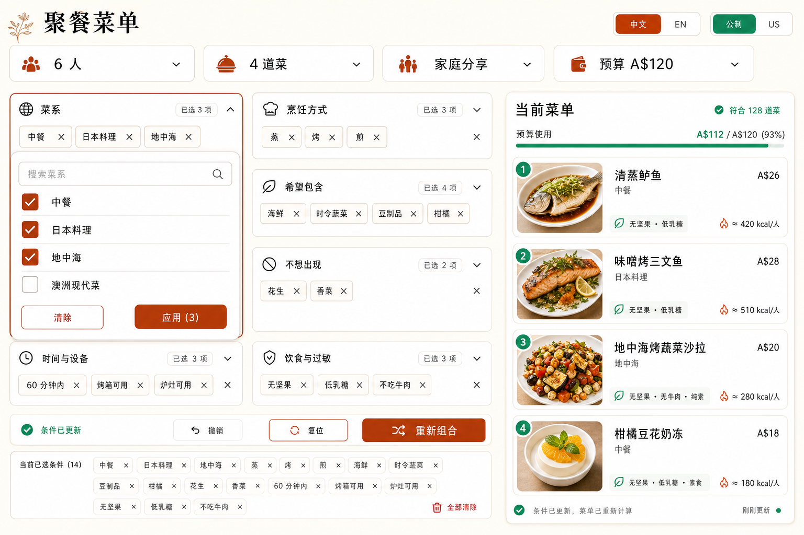
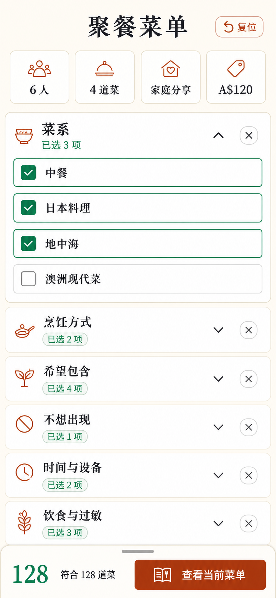
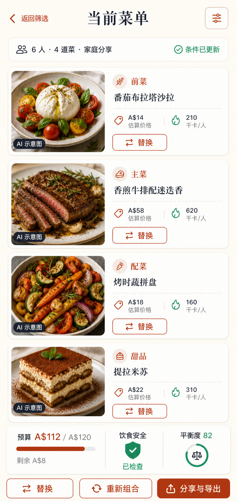

# Concept Renders

The final concept renders are AI-generated UI illustrations. They communicate layout, density, palette and interaction hierarchy; exact text rendering and component geometry must be implemented and tested in code.

## Landscape iPad filter workspace

Prompt summary: high-fidelity 16:10 culinary editorial web app, golden-ratio split, always-visible event controls, free-form faceted filters, persistent multi-select cuisine panel, live four-dish menu, warm cream/terracotta/green palette, 48–56px touch targets, no stepper and no Next action.

## Mobile filter workspace

Prompt summary: portrait free-form filter workspace with compact event controls, independently editable accordion facets, open multi-select cuisine section, selection counts and a safe-area-aware live-menu action.

## Mobile menu result

Prompt summary: portrait live-menu screen with a return-to-filters action, four dish cards, visible substitution controls, AI illustration labels, budget/safety/balance summary and share/export actions.

## Asset provenance

- Generation mode: built-in ImageGen.
- Generated for this project on 2026-08-16.
- These renders themselves should be labelled as concept illustrations when shared externally.
- The discarded sequential-wizard exploration is intentionally not part of the project deliverables.

