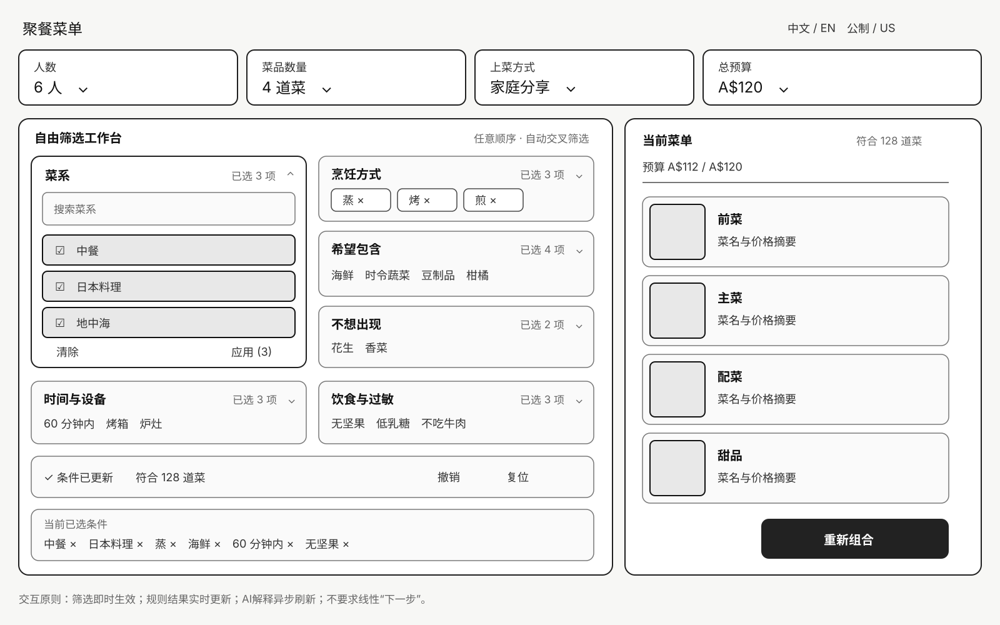
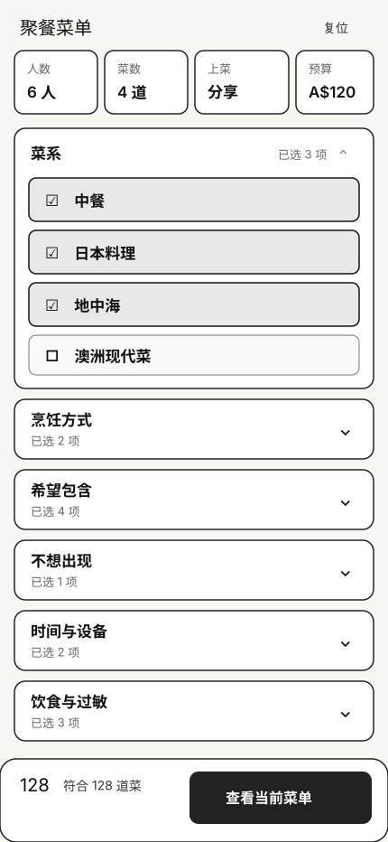

# Wireframes

These are deterministic, code-native wireframes for the approved free-form filtering model.

## Landscape iPad

Key points:

- Always-visible event controls.
- Golden-ratio filter/menu split.
- Flat facet grid with a persistent multi-select popover.
- Immediate eligible count and stale-menu feedback.
- Undo, scoped clear and confirmed full reset.

## Mobile

Key points:

- No wizard or numbered steps.
- All facets can be opened in any order.
- Selection counts remain visible when collapsed.
- Sticky eligible-count and menu entry above the safe area.

